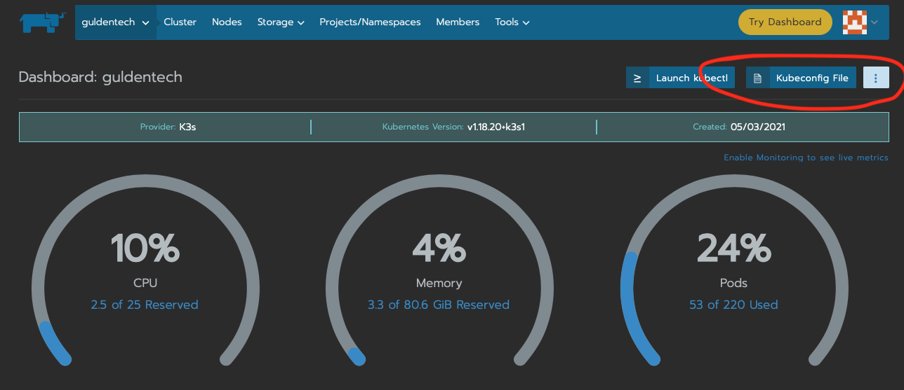

# Access

To gain access to GuldenTech and be able to deploy applications, please raise a git issue here https://github.com/rgulden/guldentech-docs/issues and tag it with "Onboard Request"

Someone from GuldenTech will reach out and talk about your use case and see if it fits on GuldenTech.

## Post Onboarding

After you onboard, you will be able to access the Rancher console or access the cluster using kubectl. To gain access to the cluster using kubectl, log into Rancher and navigate to the guldentech cluster. Once you are at the page that shows below, click the Kubeconfig file and follow the instructions it prompts.

!> Modify the kubectl config file rancher provides to remove **certificate-authority-data: "LS0tLS1C.."** and its value and replace it with: "insecure-skip-tls-verify: true"

## Create a namespace!

Dont forget to create a namespaces on the Rancher console for your project.
