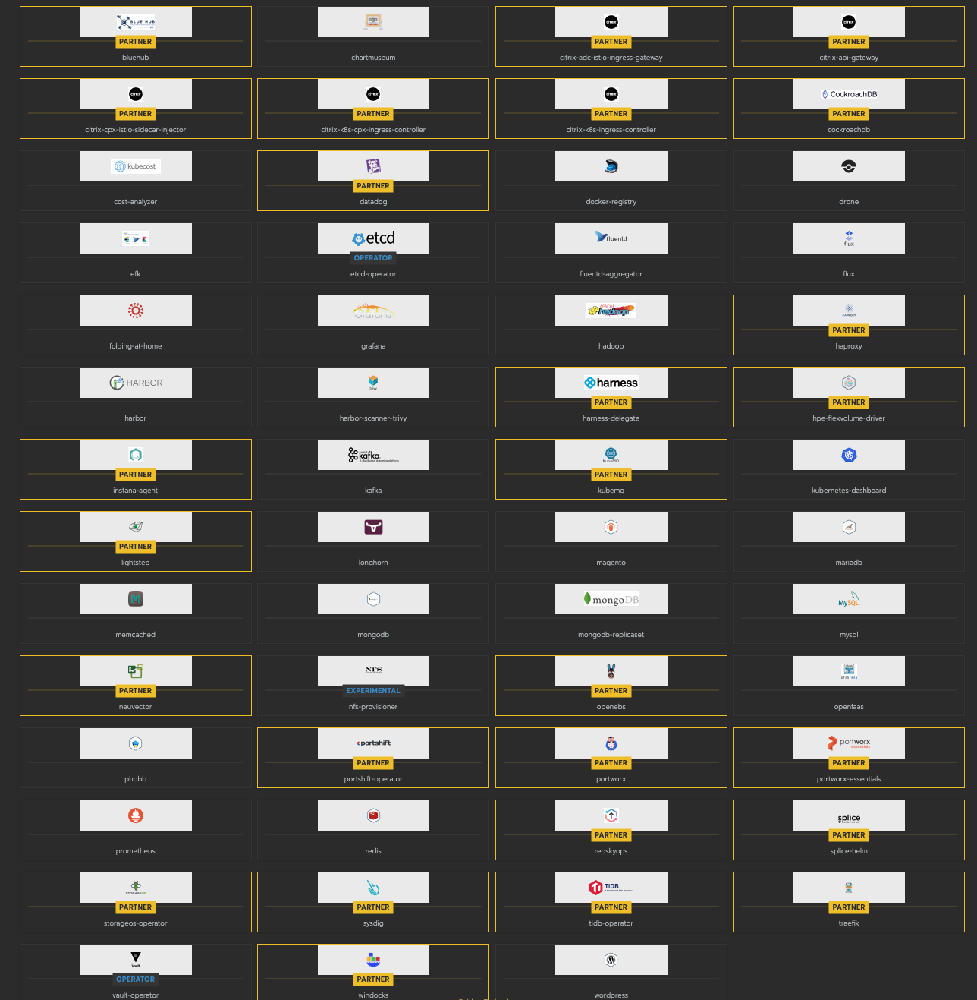

# Rancher Apps

Rancher has an easy to use deployment interface that is only available to GT Admins. If you would like to leverage one of these apps, please submit a git issue and tag it "App Deployment Request" and detail what app you are looking for.

Some common apps that are available for this process are:

* Most common DBs (Postgres, Maria, Mongo, Redis)
* WordPress
* OpenFaaS
* Argo
* List goes on and on..

