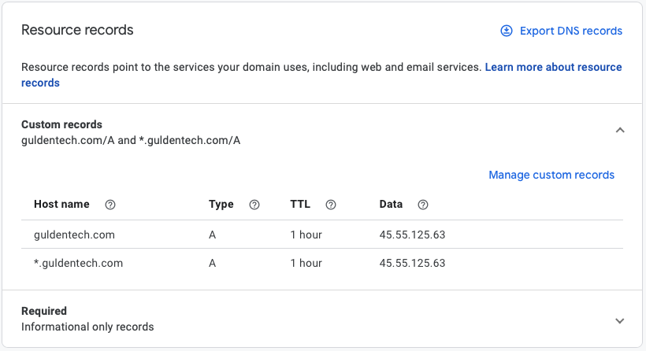

# Ingress to your application

If you would like to expose your application to outside the cluser, you will need to create an ingress and service resource and tie it to a domain name.

Below is an example:

```yaml
apiVersion: v1
kind: Service
metadata:
  name: example
  namespace: example
spec:
  type: ClusterIP
  ports:
    - name: http
      port: 80
      protocol: TCP
      targetPort: 80
  selector:
    app: example

---

kind: Ingress
apiVersion: extensions/v1beta1
metadata:
  name: example
  namespace: example
spec:
  rules:
    - host: www.example.com
      http:
        paths:
          - path: /
            backend:
              serviceName: example
              servicePort: http
    - host: example.com
      http:
        paths:
          - path: /
            backend:
              serviceName: example
              servicePort: http
```

After your resources are created and accepted, open a git issue and tag it with "Ingress Request". In the issue detail what domain you would like it tied to. If it's not a guldentech.com subdomain, some configuration will need to be set on your domain provider's side to point it to guldentech ingress controller.

Example domain provider needed configuration for non guldentech.com domains.

