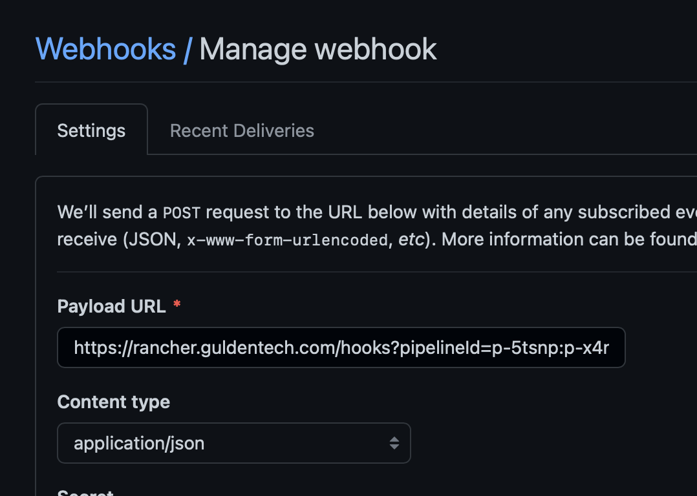

# Configuring webhook

In your github repository, under Settings > Webhooks, you should see rancher created a webhook already for your pipeline.

The only issue is, Rancher populates it with the wrong URL for the hook. For hooks to work click "edit" then update the 100.x.x.x:5443 address with rancher.guldentech.com like seen below.

## Pipeline triggers

For information on adding certain triggers based on your github branch, see rancher documentation here: https://rancher.com/docs/rancher/v2.0-v2.4/en/pipelines/config/#triggers-and-trigger-rules 