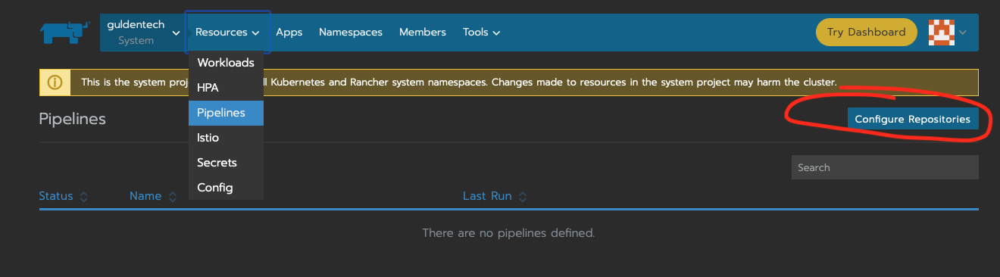

# Creating a test, build and deploy pipeline with Rancher

Please review the Rancher pipeline documentation page here (https://rancher.com/docs/rancher/v2.0-v2.4/en/pipelines/) for creating pipelines.

But the essential part is making sure on the Rancher console you follow the steps outlined after clicking "Configure Repos".

If it's your first time it will ask you to setup your connection to github. Follow the steps it says.